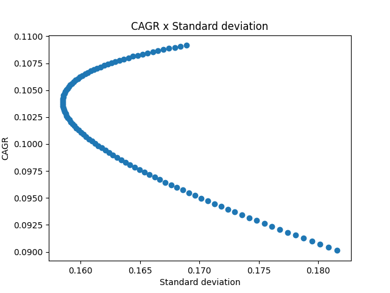
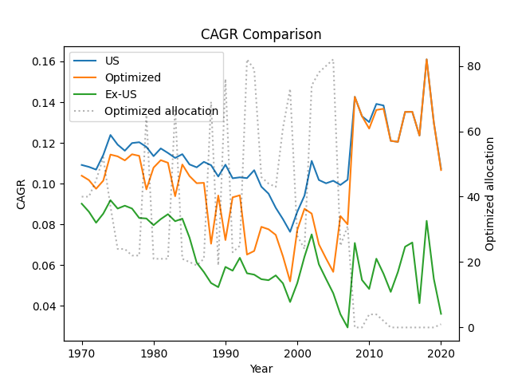
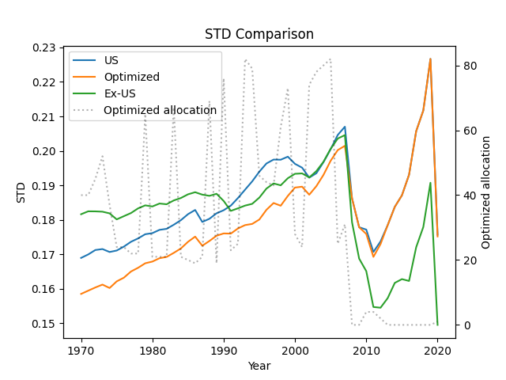

# International Diversification Study

The data was obtained using the API from the website [https://testfol.io/](testfol.io).

VTI/VXUS ranges were varied from 0 to 100. The starting year ranged from 1970 to 2020.

For each year, the volatility curve (standard deviation) x cagr was plotted. The optimized VTI/VXUS ratio occurs at the vertex of the curve.

With the value obtained (optimized VXUS proportion), the following graphs were plotted showing the 3 curves:

- CAGR/Volatility of 100% US allocation;
- CAGR/Volatility of optimized allocation;
- CAGR/Volatility of 100% ex-US allocation;

